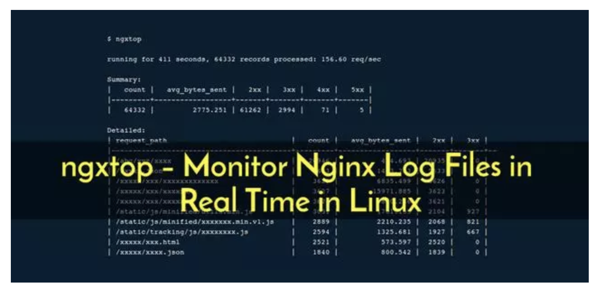
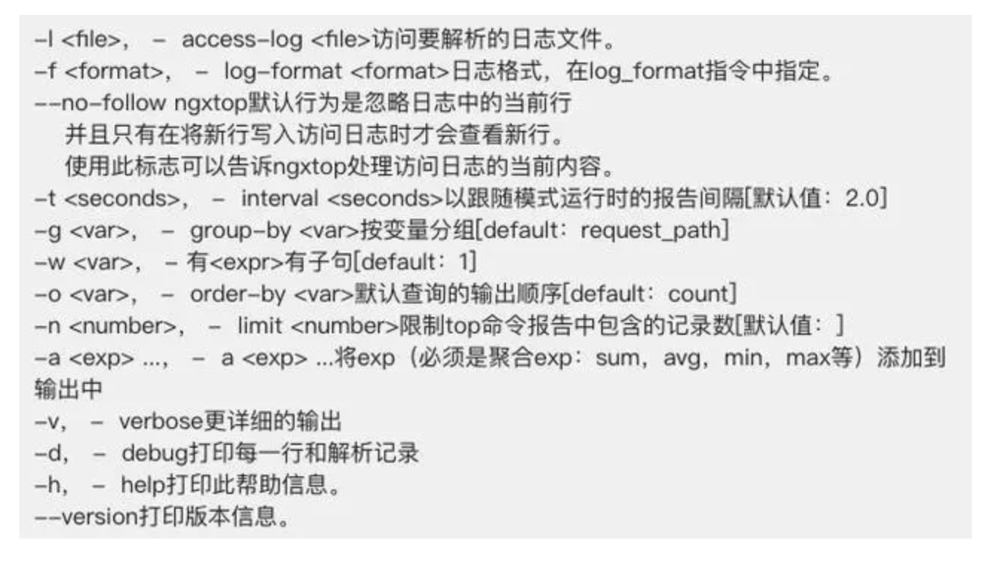

Linux运维工程师的首要职责就是保证业务7 x 24小时稳定的运行，监控Web服务器对于查看网站上发生的情况至关重要。关注最多的便是日志变动，查看实时日志文件变动大家第一反应应该是'tail -f /path/to/log'命令吧，但是如果每个网站的访问日志都是使用这种方式查看也是相当崩溃的，今天小编就跟大家分享一个强大的Nginx日志监控工具。

ngxtop是一个基于python的程序，可以在Python上安装。ngxtop通过实时解析nginx访问日志，并将结果（nginx服务器的有用指标）输出到终端。




## 主要的功能

- 当前有效请求
- 总请求计数摘要
- 按状态代码提供的总请求数（2xx，3xx，4xx，5xx）
- 发送平均字节
- 顶级远程地址

不仅能实时监控Nginx日志的访问还可以对以前的日志进行排查整理。


## 在Linux上安装ngxtop


```bash
wget http://dl.fedoraproject.org/pub/epel/7/x86_64/e/epel-release-7-6.noarch.rpm
rpm -ivh epel-release-7-6.noarch.rpm

然后执行以下命令安装pip
yum install python-pip

最后使用下面安装ngxtop
pip install ngxtop

```


## ngxtop使用详解

!!! example "用法"

     1. ngxtop [选项]
     2. ngxtop [选项]（print | top | avg | sum）<var>
     3. ngxtop info

选项：




## ngxtop实践

1.使用ngxtop命令查看请求计数摘要，请求的URI，状态码请求的数量。

```bash

$ ngxtop

```

2.检查顶级客户端的IP

查看谁向你的Nginx服务器发出大量请求。

```bash


ngxtop top remote_addr
```

3.仅显示出404的HTTP请求

```bash

ngxtop -i'status> = 404'
```


4.分析access.log

```bash

ngxtop -l /path/access.log
```

5.解析Apache的offline access.log

```bash

ngxtop -f common -l /path/access.log
```

另外你可以可以使用多种组合来过滤access.log以获取有用的数据


[Github地址](https://github.com/lebinh/ngxtop)


